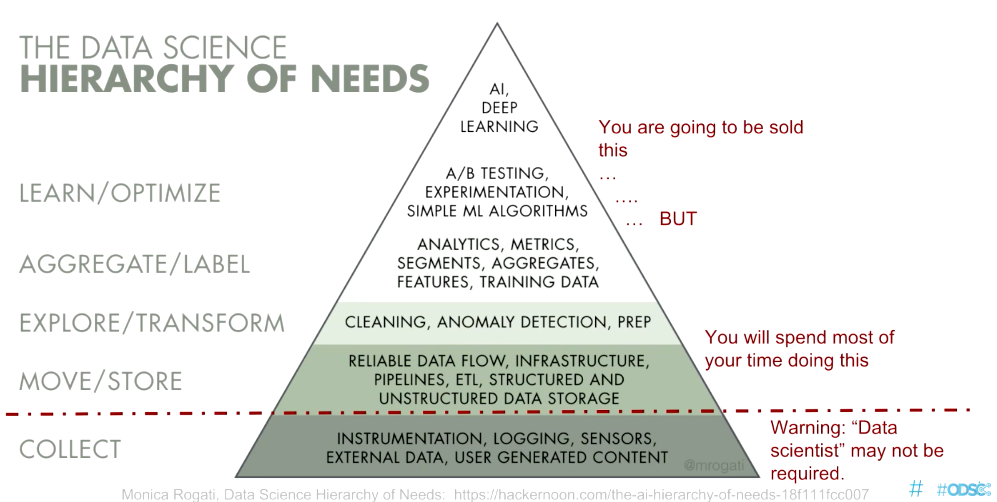

# Data Science Notes

## Contents

1. Packages
2. Data Preprocessing
3. Analytics & Visualization
4. Machine Learning
    1. Supervised Machine Learning

## Data Science Hierarchy

## References

- NumPy [online documentation](https://numpy.org/doc/)
- Pandas [user guide](https://pandas.pydata.org/docs/user_guide/index.html)
- Matplotlib [users guide](https://matplotlib.org/stable/users/index.html)
- Scikit-learn [user guide](http://scikit-learn.org/stable/user_guide.html)
- NLTK [documentation](https://www.nltk.org/)
- [Python Data Science Handbook](https://jakevdp.github.io/PythonDataScienceHandbook/index.html) by Jake VanderPlas
- Jupyter notebooks for Python Data Science Handbook [on GitHub](https://github.com/jakevdp/PythonDataScienceHandbook)

